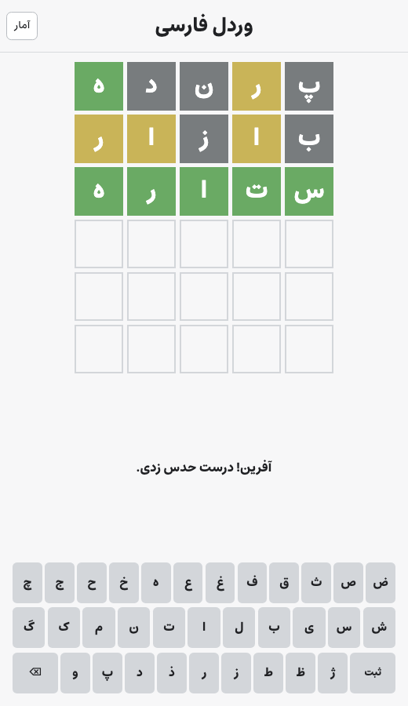
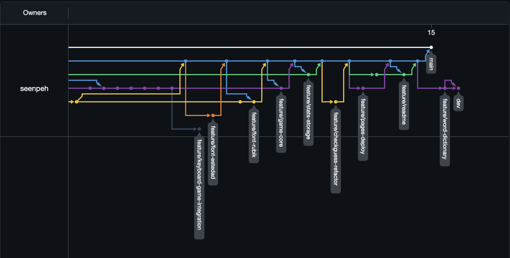
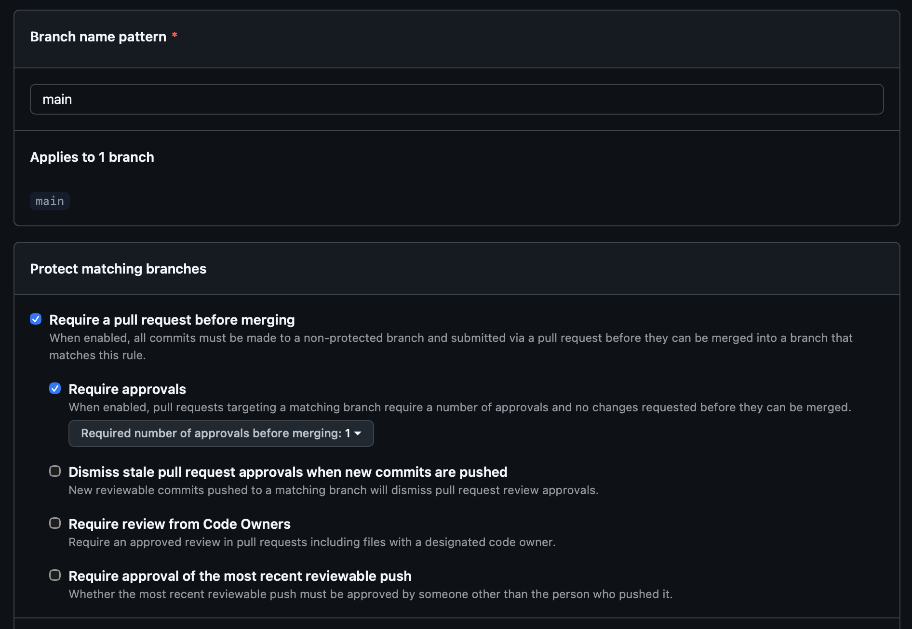
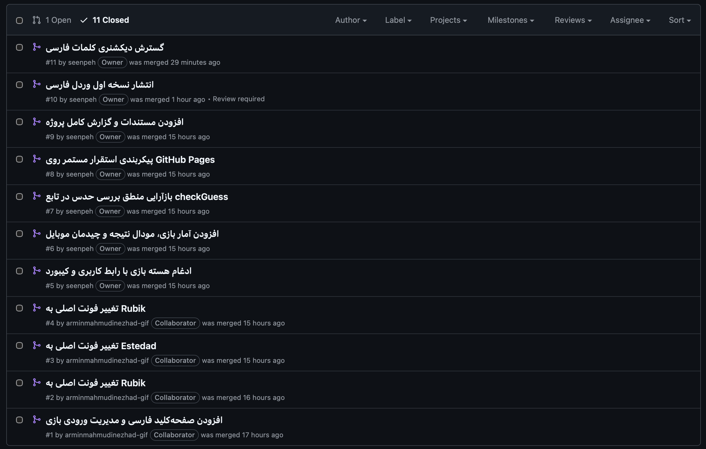
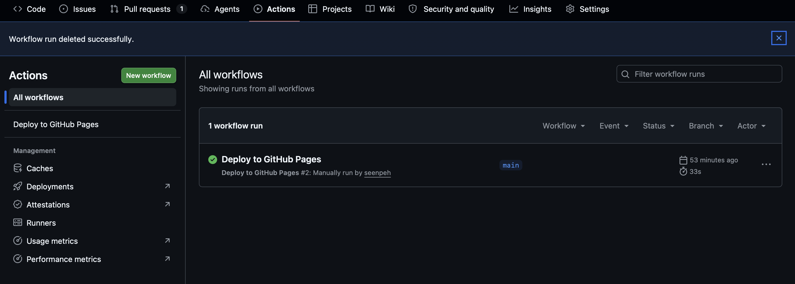

<div align="center">


**دانشگاه صنعتی شریف — دانشکده مهندسی کامپیوتر**

# گزارش آزمایش کار با Git

### پیاده‌سازی بازی وردل فارسی به‌صورت Static Frontend

**درس:** آزمایشگاه مهندسی نرم‌افزار &nbsp;·&nbsp; **استاد:** دکتر حسین‌آبادی &nbsp;·&nbsp; **ترم:** تابستان ۱۴۰۵

| دانشجو | شماره دانشجویی | ابزار | حوزه‌ی کار |
|---|---|---|---|
| سروش پورنصیری | ۴۰۰۱۰۴۸۵۶ | Claude Code | هسته‌ی بازی: گرید، وضعیت، دیکشنری، ارزیابی حدس، پایان بازی |
| آرمین محمودی‌نژاد | ۴۰۱۱۷۰۶۴۸ | Codex | رابط کاربری: کیبورد فارسی، ورودی، آمار، مودال، چیدمان موبایل |

🔗 **آدرس سایت منتشرشده:** https://seenpeh.github.io/Wordle-Software-Engineering/

</div>

---

## فهرست

- [۱. معرفی نرم‌افزار](#۱-معرفی-نرمافزار)
- [۲. تحقق اهداف آزمایش](#۲-تحقق-اهداف-آزمایش)
- [۳. ساختار شاخه‌ها](#۳-ساختار-شاخهها)
- [۴. فرآیند کامیت‌ها](#۴-فرآیند-کامیتها)
- [۵. تعارض‌ها و نحوه‌ی حل آن‌ها](#۵-تعارضها-و-نحوهی-حل-آنها)
- [۶. محافظت از شاخه‌ی main](#۶-محافظت-از-شاخهی-main)
- [۷. درخواست‌های ادغام](#۷-درخواستهای-ادغام)
- [۸. استقرار مستمر](#۸-استقرار-مستمر)
- [۹. اجرای محلی](#۹-اجرای-محلی)
- [۱۰. پاسخ به پرسش‌ها](#۱۰-پاسخ-به-پرسشها)

---

## ۱. معرفی نرم‌افزار

بازی وردل فارسی یک نرم‌افزار **static frontend** است که با HTML، CSS و JavaScript
خالص نوشته شده و هیچ فریم‌ورک، وابستگی زمان اجرا یا مرحله‌ی build ندارد. بازیکن
باید یک کلمه‌ی پنج‌حرفی فارسی را در شش نوبت حدس بزند و پس از هر حدس، رنگ خانه‌ها
وضعیت هر حرف را نشان می‌دهد: سبز یعنی حرف در جای درست است، زرد یعنی در کلمه هست
ولی جایش اشتباه است و خاکستری یعنی در کلمه وجود ندارد.

<div align="center">


<sub><b>تصویر ۱</b> — نمای بازی پس از سه حدس</sub>
</div>

### معماری رویدادمحور

ماژول‌ها **از طریق رویداد** با هم صحبت می‌کنند و نه با فراخوانی مستقیم. این
تصمیم معماری باعث شد دو عضو تیم بتوانند هم‌زمان و بدون وابستگی به کد یکدیگر پیش
بروند؛ کیبورد بدون آنکه از وجود هسته‌ی بازی خبر داشته باشد رویداد ورودی منتشر
می‌کند و ماژول آمار صرفاً به رویداد پایان بازی گوش می‌دهد.

```
┌──────────────┐   wordle:input          ┌──────────────┐
│  keyboard.js │ ──────────────────────▶ │   game.js    │
│   input.js   │                         │  (کنترلر)    │
└──────────────┘                         └──────┬───────┘
       ▲                                        │
       │       wordle:guess-evaluated           │
       └────────────────────────────────────────┤
                                                │
┌──────────────┐   wordle:game-ended            │
│   stats.js   │ ◀──────────────────────────────┘
│stats-modal.js│
└──────────────┘
```

| رویداد | منتشرکننده | شنونده | داده |
|---|---|---|---|
| `wordle:input` | `input.js` | `game.js` | `{action, value}` |
| `wordle:guess-evaluated` | `game.js` | `keyboard.js` | `{evaluations}` |
| `wordle:game-ended` | `game.js` | `stats.js` | `{won, targetWord}` |
| `wordle:stats-updated` | `stats.js` | `stats-modal.js` | `{stats}` |

> **نکته:** قرارداد رویدادها در یک فایل بی‌طرف (`input.js`) تعریف شده است، نه در
> `keyboard.js` یا `game.js`. بنابراین هیچ‌کدام از این دو مالک قرارداد نیستند و
> هر دو فقط به همان فایل مشترک وابسته‌اند.

### فایل‌های پروژه

| فایل | نقش |
|---|---|
| `index.html` | ساختار صفحه، کیبورد مجازی و مودال آمار |
| `css/styles.css` | تم، چیدمان گرید و کیبورد، طراحی واکنش‌گرا |
| `js/config.js` | ثابت‌های بازی: طول کلمه، تعداد حدس، وضعیت حروف |
| `js/board.js` | ساخت گرید شش در پنج و به‌روزرسانی خانه‌ها |
| `js/state.js` | بافر حدس در حال تایپ و وضعیت بازی |
| `js/dictionary.js` | دیکشنری خودکارساخته: ۱۰٬۱۶۷ کلمه‌ی معتبر و ۸۶۸ کلمه‌ی هدف |
| `js/words.js` | واسط دسترسی به دیکشنری و انتخاب کلمه‌ی هدف |
| `js/evaluate.js` | مقایسه‌ی حدس با کلمه‌ی هدف |
| `js/game.js` | کنترلر بازی: اتصال ورودی به وضعیت، رنگ‌آمیزی، پایان بازی |
| `js/input.js` | نرمال‌سازی ورودی، شامل تبدیل «ي» و «ك» عربی |
| `js/keyboard.js` | کیبورد مجازی و فیزیکی و بازخورد رنگی کلیدها |
| `js/stats.js` | ذخیره‌سازی آمار در `localStorage` |
| `js/stats-modal.js` | نمایش آمار در `<dialog>` با اعداد فارسی |
| `tests/` | ۲۸ آزمون با `node --test` |
| `report/` | مستندات پشتیبان: تصاویر و تاریخچه‌ی گفتگو با دستیارها |

---

## ۲. تحقق اهداف آزمایش

| هدف | وضعیت | شرح |
|---|:---:|---|
| استفاده از `.gitignore` | ✅ | در نخستین کامیت پروژه اضافه شد و `node_modules/`، `dist/`، `.env`، `.DS_Store` و فایل‌های ویرایشگر را کنار می‌گذارد |
| حداقل ۲۰ کامیت معنادار | ✅ **۲۵** | بدون احتساب ۱۷ کامیت merge. هر کامیت یک اتفاق مشخص را ثبت می‌کند و از قرارداد Conventional Commits پیروی می‌کند |
| حداقل سه شاخه‌ی معنادار | ✅ **۱۳ شاخه** | سه نوع شاخه با اهداف متفاوت: `main` پایدار، `dev` برای یکپارچه‌سازی و ده شاخه‌ی `feature/*` |
| حداقل دو تعارض حل‌شده | ✅ **سه تعارض** | یکی از آن‌ها عمداً برنامه‌ریزی شد تا سناریوی تغییر هم‌زمان یک خط توسط دو نفر تمرین شود |
| محافظت از شاخه‌ی `main` | ✅ | ادغام فقط از راه pull request، با الزام حداقل یک تأیید. push مستقیم، force push و حذف شاخه مسدود است |
| ادغام از راه pull request | ✅ **۱۳ درخواست** | هیچ شاخه‌ای به‌صورت مستقیم ادغام نشده است |
| استقرار مستمر با GitHub Actions | ✅ | هر push روی `main` ابتدا آزمون‌ها را اجرا و سپس سایت را منتشر می‌کند |
| گزارش در `README` | ✅ | همین سند |

---

## ۳. ساختار شاخه‌ها

سه نوع شاخه با اهداف متفاوت به کار رفت:

- **`main`** — همیشه قابل استقرار. هیچ‌کس مستقیماً روی آن کامیت نمی‌کند و فقط از
  طریق درخواست ادغام به‌روز می‌شود. هر push روی این شاخه یک استقرار خودکار روی
  GitHub Pages راه می‌اندازد.
- **`dev`** — محل یکپارچه‌سازی. کار دو عضو تیم اینجا کنار هم می‌نشیند و تعارض‌ها
  اینجا حل می‌شوند، پیش از آنکه چیزی به `main` برسد.
- **`feature/*`** — هر شاخه یک قابلیت مشخص و مستقل، با نام‌گذاری توصیفی.

```
main                              شاخه پایدار و محافظت‌شده، منبع استقرار
 └── dev                          شاخه یکپارچه‌سازی
      ├── feature/ui-keyboard            کیبورد مجازی و مدیریت ورودی
      ├── feature/game-core              هسته بازی: گرید، وضعیت، ارزیابی
      ├── feature/stats-storage          آمار، مودال و چیدمان موبایل
      ├── feature/font-rubik             تغییر فونت به Rubik
      ├── feature/font-estedad           تغییر فونت به Estedad
      ├── feature/checkguess-refactor    بازآرایی منطق بررسی حدس
      ├── feature/word-dictionary        گسترش دیکشنری کلمات
      ├── feature/pages-deploy           پیکربندی استقرار مستمر
      ├── feature/readme                 مستندسازی پروژه
      └── feature/upload-report          افزودن گزارش و مستندات
```

<div align="center">


<sub><b>تصویر ۲</b> — نمودار شبکه‌ی مخزن. هر شاخه‌ی feature از dev جدا می‌شود و پس از تکمیل به آن بازمی‌گردد. خط سفید بالا شاخه‌ی main است که فقط در نقاط انتشار به‌روز می‌شود.</sub>
</div>

---

## ۴. فرآیند کامیت‌ها

کار میان دو عضو تیم تقسیم شد. جدول زیر بیست کامیت نخست را نشان می‌دهد؛ کامیت‌های
بعدی مربوط به گسترش دیکشنری، پیکربندی استقرار و مستندسازی است.

| # | شناسه | نویسنده | اتفاق |
|:---:|---|---|---|
| ۱ | `7336179` | سروش | راه‌اندازی مخزن، `.gitignore` و اسکلت اولیه |
| ۲ | `019016c` | آرمین | چیدمان کیبورد مجازی فارسی |
| ۳ | `996cb4a` | آرمین | اتصال کیبورد مجازی به کنش‌های بازی |
| ۴ | `e84062b` | آرمین | پشتیبانی از کیبورد فیزیکی |
| ۵ | `3cbbbc7` | آرمین | رنگ‌آمیزی کلیدها بر اساس بازخورد حدس |
| ۶ | `31ff82b` | آرمین | ذخیره نتایج بازی در `localStorage` |
| ۷ | `ca4fe50` | آرمین | نمایش نتیجه در مودال دسترس‌پذیر |
| ۸ | `741ab8e` | آرمین | بهینه‌سازی چیدمان برای موبایل |
| ۹ | `df8b806` | سروش | ساخت ساختار پوشه‌ها و توکن‌های تم |
| ۱۰ | `303bc9f` | سروش | رندر گرید شش ردیفی × پنج حرفی |
| ۱۱ | `2080701` | آرمین | تعریف Rubik به‌عنوان فونت اصلی |
| ۱۲ | `129f19c` | سروش | تغییر فونت پایه به Estedad |
| ۱۳ | `ab58ff4` | سروش | مدیریت حدس در حال تایپ |
| ۱۴ | `18f2c6f` | سروش | افزودن دیکشنری کلمات پنج‌حرفی |
| ۱۵ | `b9e8ab3` | سروش | ارزیابی حدس در برابر کلمه هدف |
| ۱۶ | `be0c91b` | سروش | رنگ‌آمیزی خانه‌ها بر اساس نتیجه |
| ۱۷ | `a3e876c` | سروش | مدیریت برد و باخت و پیام نتیجه |
| ۱۸ | `a5023e2` | آرمین | استفاده از Estedad به‌عنوان فونت اصلی |
| ۱۹ | `83bd237` | آرمین | تعریف متغیر فونت Rubik |
| ۲۰ | `b52f43a` | آرمین | بازآرایی منطق بررسی حدس در `checkGuess` |
| ۲۱ | `cf3dbe0` | سروش | گسترش دیکشنری به ده هزار کلمه |
| ۲۲ | `f428b73` | سروش | پیکربندی استقرار روی GitHub Pages |
| ۲۳+ | — | هر دو | مستندسازی و گزارش نهایی |

---

## ۵. تعارض‌ها و نحوه‌ی حل آن‌ها

در هر سه تعارض، کار هیچ‌یک از دو عضو تیم دور ریخته نشد و همواره هر دو طرف تلفیق
شدند.

### تعارض یکم — ادغام `dev` در `feature/game-core`

**کامیت حل:** `cd0b85d`

هر دو عضو تیم مستقلاً فایل‌های پایه‌ی یکسانی ساخته بودند، بنابراین Git هیچ جد
مشترکی برای مقایسه نداشت و سه تعارض هم‌زمان رخ داد:

```
CONFLICT (add/add):  css/styles.css
CONFLICT (content):  index.html
CONFLICT (add/add):  js/app.js
```

| فایل | تصمیم |
|---|---|
| `index.html` | اسکلت معنایی `dev` (با `aria-label`) مبنا قرار گرفت و گرید بازی جای placeholder نشست؛ تگ `<script>` تکراری حذف شد |
| `js/app.js` | هر دو راه‌اندازی ترکیب شدند — چون معماری رویدادمحور است، ماژول‌ها بدون وابستگی مستقیم کنار هم نشستند |
| `css/styles.css` | هر دو استایل‌شیت نگه داشته شد و رنگ‌های هارد‌کدشده‌ی کیبورد به متغیرهای مشترک تبدیل شدند |

### تعارض دوم — تعارض عمدی روی فونت

**کامیت حل:** `e5cc891`

این تعارض به‌صورت برنامه‌ریزی‌شده ایجاد شد تا سناریوی واقعیِ تغییر هم‌زمان یک خط
توسط دو نفر تمرین شود:

۱. شاخه‌ی `feature/font-estedad` فونت اصلی را `Estedad` کرد و با
[PR #3](https://github.com/seenpeh/Wordle-Software-Engineering/pull/3) وارد `dev`
شد.
۲. شاخه‌ی `feature/font-rubik` که همان خط `--font-family` را به `Rubik` تغییر
داده بود، در [PR #4](https://github.com/seenpeh/Wordle-Software-Engineering/pull/4)
با تعارض مواجه شد.

**تصمیم:** به‌جای انتخاب یک‌طرفه، هر دو `@font-face` نگه داشته شدند و ترتیب
فونت‌ها به این شکل حل شد:

```css
--font-family: "Estedad", "Rubik", Tahoma, Arial, sans-serif;
```

`Estedad` فونت اصلی ماند چون یک فونت variable فارسی است و برای متن فارسی رابط
بازی خوانایی بهتری دارد؛ `Rubik` به‌عنوان fallback دوم برای متون لاتین حفظ شد.

### تعارض سوم — ادغام مجدد `dev` در `feature/game-core`

**کامیت حل:** `ed257d5`

پس از حل تعارض فونت روی `dev`، شاخه‌ی هسته‌ی بازی دوباره ادغام شد و
`css/styles.css` تعارض گرفت.

> **یک اشکال واقعی که هنگام حل این تعارض کشف شد:** آدرس CDN فونت Estedad خطای
> `404` می‌داد، زیرا jsDelivr برچسب `@latest` را برای مخازن `gh` پشتیبانی
> نمی‌کند (فقط برای بسته‌های npm). در نتیجه فونت بی‌صدا به fallback برمی‌گشت.
> آدرس به نسخه‌ی پین‌شده اصلاح شد و بارگذاری صحیح هر دو فونت در مرورگر تأیید شد.

---

## ۶. محافظت از شاخه‌ی main

روی شاخه‌ی `main` قانون محافظت اعمال شده است:

- ✅ **Require a pull request before merging** — امکان push مستقیم وجود ندارد
- ✅ **Require approvals** — هر درخواست باید توسط عضو دیگر تیم تأیید شود
- ✅ force push و حذف شاخه مسدود است

<div align="center">


<sub><b>تصویر ۳</b> — قانون محافظت شاخه‌ی main</sub>
</div>

این محدودیت در عمل هم آزموده شد: تلاش برای ادغام یکی از درخواست‌ها با پیام
`base branch policy prohibits the merge` رد شد. یعنی قانون واقعاً کار می‌کند و
فقط روی کاغذ نیست.

---

## ۷. درخواست‌های ادغام

تمام ادغام‌های پروژه از راه pull request انجام شد.

| # | از | به | موضوع |
|:---:|---|---|---|
| [۱](https://github.com/seenpeh/Wordle-Software-Engineering/pull/1) | `feature/ui-keyboard` | `dev` | افزودن صفحه‌کلید فارسی و مدیریت ورودی |
| [۲](https://github.com/seenpeh/Wordle-Software-Engineering/pull/2) | `feature/font-rubik` | `dev` | تغییر فونت اصلی به Rubik |
| [۳](https://github.com/seenpeh/Wordle-Software-Engineering/pull/3) | `feature/font-estedad` | `dev` | تغییر فونت اصلی به Estedad |
| [۴](https://github.com/seenpeh/Wordle-Software-Engineering/pull/4) | `feature/font-rubik` | `dev` | حل تعارض فونت |
| [۵](https://github.com/seenpeh/Wordle-Software-Engineering/pull/5) | `feature/game-core` | `dev` | ادغام هسته بازی با رابط کاربری و کیبورد |
| [۶](https://github.com/seenpeh/Wordle-Software-Engineering/pull/6) | `feature/stats-storage` | `dev` | افزودن آمار بازی، مودال نتیجه و چیدمان موبایل |
| [۷](https://github.com/seenpeh/Wordle-Software-Engineering/pull/7) | `feature/checkguess-refactor` | `dev` | بازآرایی منطق بررسی حدس |
| [۸](https://github.com/seenpeh/Wordle-Software-Engineering/pull/8) | `feature/pages-deploy` | `dev` | پیکربندی استقرار مستمر |
| [۹](https://github.com/seenpeh/Wordle-Software-Engineering/pull/9) | `feature/readme` | `dev` | افزودن مستندات پروژه |
| [۱۰](https://github.com/seenpeh/Wordle-Software-Engineering/pull/10) | `dev` | `main` | انتشار نسخه اول |
| [۱۱](https://github.com/seenpeh/Wordle-Software-Engineering/pull/11) | `feature/word-dictionary` | `dev` | گسترش دیکشنری کلمات فارسی |
| [۱۲](https://github.com/seenpeh/Wordle-Software-Engineering/pull/12) | `dev` | `main` | انتشار دیکشنری گسترش‌یافته |
| [۱۳](https://github.com/seenpeh/Wordle-Software-Engineering/pull/13) | `feature/upload-report` | `main` | افزودن گزارش نهایی و مستندات |

<div align="center">


<sub><b>تصویر ۴</b> — فهرست درخواست‌های ادغام؛ برچسب نویسنده نشان می‌دهد کار میان دو عضو تیم تقسیم شده است</sub>
</div>

---

## ۸. استقرار مستمر

استقرار با **GitHub Actions** انجام می‌شود. فایل پیکربندی:
[`.github/workflows/deploy.yml`](.github/workflows/deploy.yml)

```
push روی main
      │
      ▼
┌─────────────┐        ┌──────────────────┐
│  job: test  │ ─────▶ │   job: deploy    │
│  npm test   │        │  GitHub Pages    │
└─────────────┘        └──────────────────┘
   اگر شکست بخورد            اجرا نمی‌شود
```

مرحله‌ی استقرار به مرحله‌ی آزمون وابسته است (`needs: test`)، بنابراین اگر
آزمون‌ها شکست بخورند هیچ نسخه‌ی معیوبی منتشر نمی‌شود. چون پروژه static است و
مرحله‌ی build ندارد، کل مخزن مستقیماً به‌عنوان artifact آپلود می‌شود. همه‌ی
مسیرها نسبی هستند، بنابراین سرو شدن سایت در زیرشاخه مشکلی ایجاد نمی‌کند.

<div align="center">


<sub><b>تصویر ۵</b> — اجرای موفق گردش‌کار Deploy to GitHub Pages روی شاخه‌ی main</sub>
</div>

---

## ۹. اجرای محلی

```bash
npm start        # سرو کردن سایت به‌صورت محلی
npm test         # اجرای آزمون‌ها با node --test
```

پروژه هیچ وابستگی زمان اجرا ندارد؛ `npm start` فقط یک سرور static موقت بالا
می‌آورد. مجموعه‌ی آزمون شامل **۲۸ آزمون** است که نرمال‌سازی ورودی، اولویت وضعیت
کلیدها، اعتبار دیکشنری، ارزیابی حدس و محاسبات آمار را پوشش می‌دهند.

---

## ۱۰. پاسخ به پرسش‌ها

> پاسخ‌ها بر پایه‌ی استاندارد **ASD-STE100** نوشته شده‌اند: جمله‌های کوتاه، یک
> فکر در هر جمله و فعل معلوم.

### ۱. پوشه‌ی `.git` چیست؟

پوشه‌ی `.git` پایگاه داده‌ی مخزن است. این پوشه تمام تاریخچه‌ی پروژه را نگه
می‌دارد. پوشه این داده‌ها را ذخیره می‌کند: اشیای Git شامل commit و tree و blob،
شاخه‌ها و برچسب‌ها، ناحیه‌ی stage، پیکربندی مخزن، مخازن راه دور و گزارش حرکت‌های
HEAD. دستور `git init` این پوشه را می‌سازد. دستور `git clone` نیز آن را از یک
مخزن راه دور کپی می‌کند.

### ۲. منظور از atomic بودن چیست؟

یک commit اتمی فقط یک تغییر منطقی را در بر می‌گیرد. تمام فایل‌های آن به یک هدف
مربوط هستند. اگر شما آن commit را برگردانید، هیچ کار دیگری خراب نمی‌شود.

یک pull request اتمی نیز فقط یک قابلیت یا یک اصلاح را ارائه می‌کند. بازبین
می‌تواند آن را ساده بفهمد. تیم می‌تواند آن را مستقل از کارهای دیگر بپذیرد یا رد
کند.

### ۳. تفاوت `fetch` و `pull` و `merge` و `rebase` و `cherry-pick`

| دستور | کار |
|---|---|
| `fetch` | تغییرات مخزن راه دور را دریافت می‌کند. این دستور شاخه‌ی کاری شما را تغییر نمی‌دهد |
| `pull` | ابتدا fetch را اجرا می‌کند و سپس تغییرات را در شاخه‌ی کاری ادغام می‌کند. برابر است با `fetch` به‌همراه `merge` |
| `merge` | دو شاخه را با یک commit جدید به هم می‌پیوندد. تاریخچه‌ی اصلی دست‌نخورده می‌ماند |
| `rebase` | commitهای شما را روی نوک شاخه‌ی دیگر دوباره اعمال می‌کند. نتیجه یک تاریخچه‌ی خطی است، اما شناسه‌ی commitها تغییر می‌کند |
| `cherry-pick` | فقط یک commit مشخص را از شاخه‌ای دیگر روی شاخه‌ی جاری اعمال می‌کند |

**نمونه از همین پروژه:** یک شاخه‌ی هم‌تیمی نُه commit تکراری را با خود حمل
می‌کرد. تیم فقط همان یک commit بازآرایی را با `cherry-pick` برداشت و تاریخچه‌ی
`dev` تمیز ماند.

### ۴. تفاوت `reset` و `revert` و `restore` و `switch` و `checkout`

| دستور | کار |
|---|---|
| `reset` | نشانگر شاخه را به یک commit پیشین می‌برد. این دستور تاریخچه را بازنویسی می‌کند. آن را روی شاخه‌ی مشترک اجرا نکنید |
| `revert` | یک commit جدید می‌سازد که اثر commit پیشین را خنثی می‌کند. تاریخچه حفظ می‌شود. این روش برای شاخه‌ی مشترک ایمن است |
| `restore` | محتوای فایل‌ها را از commit یا از ناحیه‌ی stage بازمی‌گرداند |
| `switch` | شاخه‌ی جاری را عوض می‌کند. این دستور فقط همین یک کار را انجام می‌دهد |
| `checkout` | دستور قدیمی است و هر دو کار بالا را انجام می‌دهد. Git دستورهای `switch` و `restore` را جایگزین آن کرد، زیرا `checkout` بیش از حد چندکاره بود |

### ۵. ناحیه‌ی stage و دستور `stash`

ناحیه‌ی stage یا index یک ناحیه‌ی میانی میان پوشه‌ی کاری و مخزن است. شما
تغییرات را با `git add` به این ناحیه می‌برید. سپس `git commit` فقط همین تغییرات
را ثبت می‌کند. این ناحیه به شما اجازه می‌دهد که یک commit اتمی بسازید.

دستور `git stash` تغییرات ناتمام را موقتاً کنار می‌گذارد و پوشه‌ی کاری را پاک
می‌کند. شما می‌توانید شاخه را عوض کنید. سپس با `git stash pop` تغییرات را
بازمی‌گردانید.

### ۶. مفهوم snapshot و ارتباط آن با commit

هر commit یک snapshot کامل از تمام فایل‌های پروژه در یک لحظه است. commit یک
مجموعه تفاوت یا diff ذخیره نمی‌کند.

Git برای فایل‌های تغییرنکرده شیء تازه نمی‌سازد و به همان شیء پیشین اشاره می‌کند.
پس فضای ذخیره‌سازی هدر نمی‌رود. آن diff که شما در `git show` می‌بینید، در لحظه‌ی
نمایش و از مقایسه‌ی دو snapshot ساخته می‌شود. این طراحی، دستورهایی مانند
`checkout` و `merge` را سریع می‌کند، زیرا Git تفاوت‌ها را دوباره محاسبه نمی‌کند.

### ۷. تفاوت مخزن محلی و مخزن راه دور

مخزن محلی روی رایانه‌ی شما قرار دارد. شما بدون اتصال به شبکه در آن کار می‌کنید.
تمام تاریخچه در دسترس شماست.

مخزن راه دور روی یک سرور مانند GitHub قرار دارد. این مخزن نقطه‌ی اشتراک تیم
است. شما با `push` کار خود را به آن می‌فرستید و با `fetch` یا `pull` کار دیگران
را دریافت می‌کنید. قابلیت‌هایی مانند pull request و قانون محافظت شاخه فقط روی
مخزن راه دور وجود دارند.
